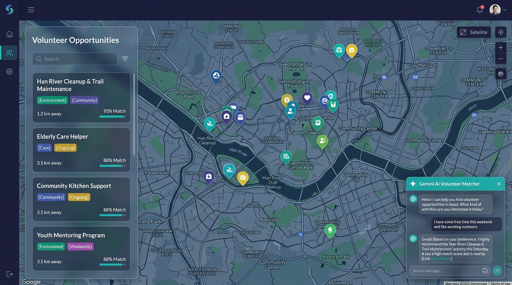
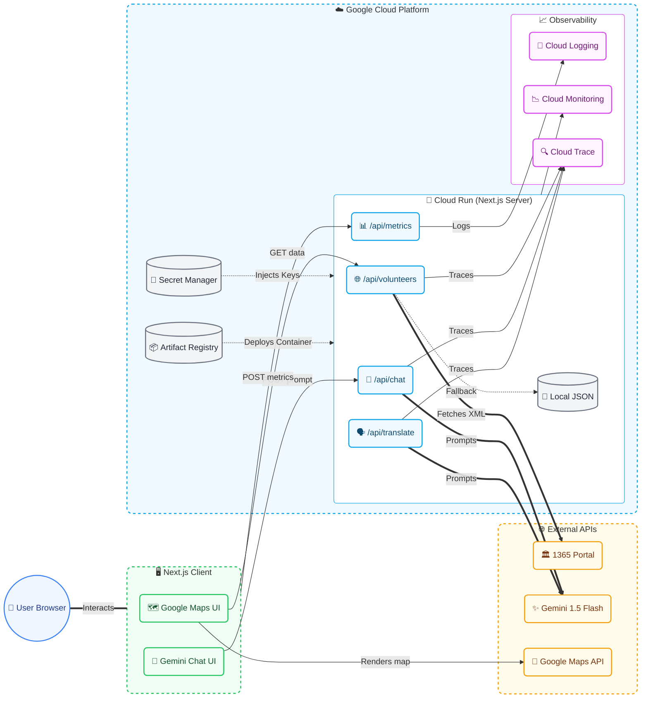

<div align="center">
  <h1>🗺️ Volunteer Map Korea</h1>
  <p><b>Bridging Goodwill and Community Through Technology</b></p>
  <p><i>A Google Cloud Study Jam Hackathon Project (2026-07-16)</i></p>

  <br />

  

  <p>
    <a href="https://volunteer-map-service-ta2zjihc7a-du.a.run.app"><b>🚀 Live Demo</b></a>
    &nbsp;&mdash;&nbsp;
    <code>https://volunteer-map-service-ta2zjihc7a-du.a.run.app</code>
  </p>
</div>

## 🌟 The Vision: A More Beautiful, Connected Korea

In our fast-paced, modern society, the spirit of humanism and community connection can sometimes feel distant. **Volunteer Map Korea** is born from the fundamental belief that small acts of kindness, when brought together, can transform our society. We aim to build a more beautiful Korea by removing the friction between those who want to help and the communities that need them.

The problem today isn't a lack of goodwill; it's a lack of accessibility. Volunteer data is often scattered across government portals (like the 1365 service) in complex, text-heavy formats. This makes it difficult for everyday citizens—especially younger generations—to intuitively discover local causes that resonate with their passions.

Our mission is to turn the desire to do good into immediate, impactful action by making volunteer opportunities as easy to find as a local coffee shop.

## 💡 The Solution

Volunteer Map Korea is an interactive, map-based platform that visualizes volunteer opportunities across South Korea in real-time. 

By aggregating national public data and presenting it geographically, we provide a seamless discovery experience. 

**Key Innovations:**
- **Interactive Spatial Discovery:** Browse opportunities geographically on an interactive map rather than scrolling through endless, paginated lists.
- **Real-Time Data Integration:** Direct synchronization with the official 1365 portal (`data.go.kr`) for the most up-to-date recruitment status and locations.
- **AI-Powered Matching:** A built-in Gemini AI assistant that chats with users to recommend personalized volunteering experiences (e.g., *"I want to do an environmental cleanup this weekend near Mapo-gu"*).
- **Graceful Degradation:** A guaranteed flawless user experience with a local fallback dataset, ensuring users can always find a way to help even if upstream government APIs experience downtime.

## 🏆 Hackathon WoW Factors!

*   **🧠 Dual-AI Engine (Gemini 1.5 Flash):**
    *   **Intelligent Agent Chat:** An interactive sidebar assistant matches vague user prompts (e.g., *"I want to help elderly people this Sunday"*) to active, geo-tagged volunteer listings.
    *   **Dynamic Multilingual Translation (`/api/translate`):** Automatically translates complex, traditional Korean government listings into English (or other languages) on the fly, breaking down language barriers for foreign residents and tourists wishing to volunteer.
*   **📊 Enterprise Observability out-of-the-box:** Fully instrumented with OpenTelemetry to track server latency, API route performance, and client-side Core Web Vitals directly to GCP Cloud Logging, Cloud Trace, and Cloud Monitoring.
*   **🛡️ Production-Ready Environment Isolation:** Zero hardcoded API keys. Implements local `.env.local` testing that seamlessly migrates to GCP Secret Manager injection on Cloud Run in production.

## 🏗️ Architecture



## 🚀 Technology Stack
*   **Framework:** Next.js 14 (App Router)
*   **Mapping:** Google Maps JavaScript API
*   **AI:** Gemini AI (Flash)
*   **Infrastructure:** Google Cloud Platform (Cloud Run, Secret Manager)
*   **Observability:** GCP Cloud Logging, Cloud Monitoring, Cloud Trace
*   **Data Source:** 행정안전부 1365 Portal (via `data.go.kr`)

## 🛠️ Getting Started (Local Development)

### Prerequisites
- Node.js 18+
- Google Cloud Account
- API Keys: Google Maps, Gemini AI, `data.go.kr`

### Setup
1. **Clone the repository:**
   ```bash
   git clone https://github.com/bbb1293/volunteer-map-korea.git
   cd volunteer-map-korea
   ```

2. **Install dependencies:**
   ```bash
   npm install
   ```

3. **Configure Environment Variables:**
   Create a `.env.local` file in the root directory:
   ```env
   GEMINI_API_KEY=your_gemini_key
   GOOGLE_MAPS_API_KEY=your_maps_key
   DATA_GO_KR_API_KEY=your_data_go_kr_key
   NEXT_PUBLIC_GOOGLE_MAPS_MAP_ID=your_map_id
   ```

   > [!NOTE]
   > **Why do we need local keys if we use GCP Secret Manager in production?**
   > * **In Production (Cloud Run):** Environment variables are securely injected directly into the container from GCP Secret Manager, so secrets are never hardcoded or exposed in Git.
   > * **In Local Development:** Since your local machine does not run inside the GCP environment, it cannot automatically inherit those secrets. To keep local development simple, fast, and isolated without requiring complex GCP credentials setup on your machine, we use `.env.local` (which is ignored by Git via `.gitignore`) to supply the keys. The code accesses them the exact same way in both environments via `process.env`.

4. **Run the development server:**
   ```bash
   npm run dev
   ```

5. **Open [http://localhost:3000](http://localhost:3000) with your browser to see the result.**

## 📈 Future Roadmap
- **OAuth Login:** Allow users to bookmark and save their favorite volunteer sites via Firebase Auth or NextAuth.
- **VMS Integration:** Include specialized social welfare data from the National Council on Social Welfare (`vms.or.kr`).
- **Push Notifications:** Alert users of urgent volunteer needs in their immediate vicinity.

---
*Built for the Google Cloud Study Jam Hackathon.*
