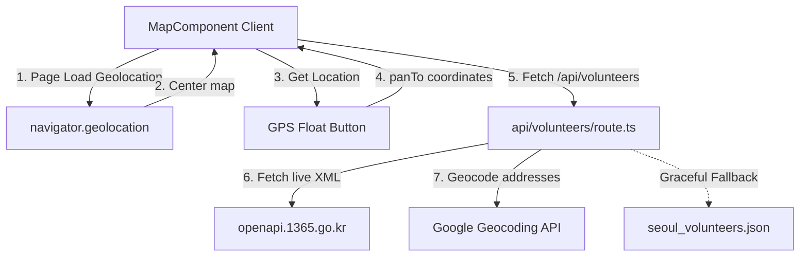

# Geolocation Centering and Live 1365 Portal Integration Implementation Plan

> **For agentic workers:** REQUIRED SUB-SKILL: Use superpowers:subagent-driven-development to implement this plan task-by-task. Steps use checkbox (`- [ ]`) syntax for tracking.

**Goal:** Implement browser geolocation map auto-centering on page load with a custom GPS float button, and integrate real-time South Korea 1365 Volunteer API data mapped via Google Geocoding with local mock fallback.

**Architecture:**
1. **Client Geolocation:** Hook into `navigator.geolocation` in `MapComponent.tsx`, center the map dynamically, and add a float button to re-trigger centering.
2. **Server API proxy:** In `/api/volunteers/route.ts`, fetch raw XML from `data.go.kr` 1365 service, extract details using optimized regex patterns, geocode addresses via Google Maps Geocoding API, and format to unified JSON. Features full fallback to local static mock data.

**Architecture Diagram:**


**Tech Stack:** Next.js 14 App Router, Google Maps JavaScript API, Google Maps Geocoding API, 1365 Public Data API.

## Global Constraints
- Keep dependencies lean: Do NOT install any external XML parsing libraries. Use robust regex-based parsing.
- Always use the server-side environment variables `DATA_GO_KR_API_KEY` and `GOOGLE_MAPS_API_KEY` safely.
- Never crash the frontend; always fall back gracefully to local `seoul_volunteers.json` if APIs fail or quotas are exceeded.

---

### Task 1: Client-Side Geolocation Centering & GPS Button

**Files:**
- Modify: `[MapComponent.tsx](file:///Users/mac/personal/volunteer-map-korea/web/src/components/MapComponent.tsx)`

**Interfaces:**
- Consumes: Standard HTML5 Geolocation API.
- Produces: Dynamic Map centering on user's coordinate system.

- [ ] **Step 1: Implement HTML5 Geolocation auto-centering on map initialization**
  Add a helper function inside `MapComponent.tsx` that triggers on successful map creation to request permission and center the map:
  ```typescript
  if (navigator.geolocation) {
    navigator.geolocation.getCurrentPosition(
      (position) => {
        const userLatLng = {
          lat: position.coords.latitude,
          lng: position.coords.longitude
        };
        newMap.setCenter(userLatLng);
        newMap.setZoom(13);
      },
      (error) => {
        console.warn("Geolocation permission denied or failed:", error);
      }
    );
  }
  ```

- [ ] **Step 2: Add floating GPS re-center button**
  Add a custom styled button on top of the Map area:
  ```tsx
  {/* GPS Float Button */}
  <button
    onClick={handleRecenter}
    className="absolute top-4 right-16 z-10 p-3 bg-white/80 dark:bg-zinc-800/80 backdrop-blur-md rounded-full shadow-lg border border-zinc-200/50 dark:border-zinc-700/50 hover:bg-white dark:hover:bg-zinc-700 transition-all duration-200 group"
    title="Center on my location"
  >
    <svg className="w-5 h-5 text-zinc-600 dark:text-zinc-300 group-hover:scale-110 transition-transform duration-200" fill="none" stroke="currentColor" viewBox="0 0 24 24">
      <path strokeLinecap="round" strokeLinejoin="round" strokeWidth="2" d="M12 8c-2.21 0-4 1.79-4 4s1.79 4 4 4 4-1.79 4-4-1.79-4-4-4zm0 0V3m0 16v-2m9-5h-2M5 12H3" />
    </svg>
  </button>
  ```

- [ ] **Step 3: Run TypeScript compiler and Next.js build to verify no build errors**
  Run: `npm run build` in `web/`
  Expected: Compiled successfully with zero type or build errors.

- [ ] **Step 4: Commit**
  ```bash
  git add web/src/components/MapComponent.tsx
  git commit -m "feat: add map geolocation auto-centering and GPS float button"
  ```

---

### Task 2: Live 1365 Volunteer API Integration & Geocoding

**Files:**
- Modify: `[route.ts](file:///Users/mac/personal/volunteer-map-korea/web/src/app/api/volunteers/route.ts)`

**Interfaces:**
- Consumes: `DATA_GO_KR_API_KEY` and `GOOGLE_MAPS_API_KEY` from environmental variables.
- Produces: `/api/volunteers` JSON payload containing real-time geocoded volunteer opportunities.

- [ ] **Step 1: Write Live API Fetching & Robust Regex XML Parsing logic**
  Replace `/api/volunteers/route.ts` with code that queries `openapi.1365.go.kr` and parses relevant elements like `progrmSj`, `nanmmGroupNm`, and `actPlace`:
  ```typescript
  import { NextResponse } from 'next/server';
  import mockData from '@/data/seoul_volunteers.json';

  export async function GET() {
    try {
      const portalKey = process.env.DATA_GO_KR_API_KEY;
      const googleKey = process.env.GOOGLE_MAPS_API_KEY;

      if (!portalKey) {
        console.warn("Public Portal Key missing, falling back to mock data");
        return NextResponse.json(mockData);
      }

      // Fetch from 1365 Volunteer Search Word API
      const url = `http://openapi.1365.go.kr/openapi/service/rest/VolunteerrecruitService/getVltrSearchWordList?serviceKey=${encodeURIComponent(portalKey)}&numOfRows=15`;
      const response = await fetch(url, { signal: AbortSignal.timeout(8000) });
      const xmlText = await response.text();

      // Parse XML items using robust regex
      const items: any[] = [];
      const itemMatches = xmlText.match(/<item>([\s\S]*?)<\/item>/g) || [];

      for (const itemXml of itemMatches) {
        const id = itemXml.match(/<progrmNo>(.*?)<\/progrmNo>/)?.[1] || '';
        const title = itemXml.match(/<progrmSj>(.*?)<\/progrmSj>/)?.[1] || '';
        const org = itemXml.match(/<nanmmGroupNm>(.*?)<\/nanmmGroupNm>/)?.[1] || '';
        const address = itemXml.match(/<actPlace>(.*?)<\/actPlace>/)?.[1] || '';

        if (!id || !title) continue;

        // Try geocoding address
        let location = { lat: 37.5665, lng: 126.9780, address }; // Default to Seoul center
        if (googleKey && address) {
          try {
            const geoUrl = `https://maps.googleapis.com/maps/api/geocode/json?address=${encodeURIComponent(address)}&key=${googleKey}`;
            const geoRes = await fetch(geoUrl);
            const geoData = await geoRes.json();
            if (geoData.status === 'OK' && geoData.results?.[0]?.geometry?.location) {
              location = {
                lat: geoData.results[0].geometry.location.lat,
                lng: geoData.results[0].geometry.location.lng,
                address
              };
            }
          } catch (err) {
            console.error("Geocoding failed for address:", address, err);
          }
        }

        items.push({
          id,
          title,
          organization: org,
          category: 'Volunteer',
          status: 'Recruiting',
          location
        });
      }

      if (items.length === 0) {
        throw new Error("No volunteer listings retrieved from public API");
      }

      return NextResponse.json({ events: items });
    } catch (error) {
      console.error("Live integration error, falling back to mock data:", error);
      return NextResponse.json(mockData);
    }
  }
  ```

- [ ] **Step 2: Verify the volunteers endpoint output using a curl command**
  Run: `curl -s http://localhost:3000/api/volunteers`
  Expected: Returns a valid JSON object matching the `{ events: [...] }` structure, successfully fetching and mapping live opportunities.

- [ ] **Step 3: Commit**
  ```bash
  git add web/src/app/api/volunteers/route.ts
  git commit -m "feat: integrate live data.go.kr 1365 Volunteer API with fallback safety"
  ```
