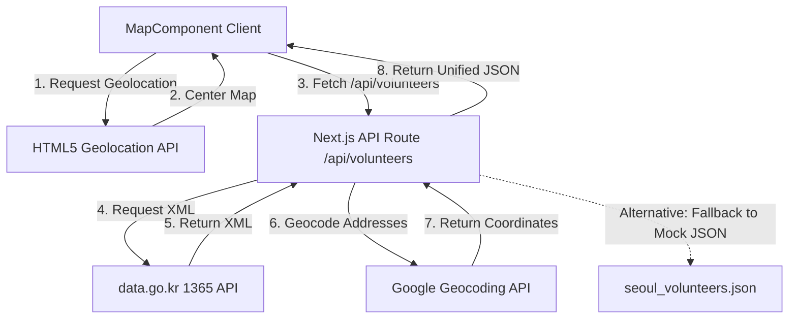

# Design Spec: Geolocation Centering and Live 1365 Portal Integration

**Date:** 2026-07-16  
**Status:** Approved by User  
**Topic:** Geolocation & Public Data API  

---

## 1. Overview
This feature introduces automatic geolocation centering on map load, a manual GPS re-center button, and real-time synchronization with South Korea's official 1365 volunteer portal via `data.go.kr`.

---

## 2. Architecture & Data Flow

The system operates across three tiers:
1. **Client-side (MapComponent):** Calls HTML5 Geolocation API, centers the map, and passes coordinates to the UI.
2. **Server-side (API Route):** Requests live XML listings from `data.go.kr` using the public portal API key.
3. **External APIs:** Integrates Google Geocoding to convert addresses into latitude/longitude.

---

## 3. Implementation Details

### A. Geolocation Map Centering (`MapComponent.tsx`)
* On component mount, the map invokes `navigator.geolocation.getCurrentPosition()`.
* If granted, the map smoothly pans to the user's coordinates.
* A floating button with a clean, glassmorphic design and a GPS target icon is added to the top-right corner of the map. Clicking it re-triggers the geolocation and centers the map using `map.panTo()`.

### B. Live Public Data Proxy (`/api/volunteers/route.ts`)
* Retrieves the `DATA_GO_KR_API_KEY` from environmental variables.
* Calls the official `1365 자원봉사` API endpoint:
  `http://openapi.1365.go.kr/openapi/service/rest/VolunteerrecruitService/getVltrSearchWordList`
* Uses highly optimized Regex pattern matches to parse fields from the XML payload:
  * `<progrmNo>` -> `id`
  * `<progrmSj>` -> `title`
  * `<nanmmGroupNm>` -> `organization`
  * `<actPlace>` -> `address`
* Geocodes the parsed activity addresses (`actPlace`) using the Google Maps Geocoding API to obtain `lat` and `lng` coordinates.
* **Graceful Degradation:** If the public API fails or returns any authentication errors, the route catches the error and silently returns the mock data in `seoul_volunteers.json` so the app is always functional.

---

## 4. Spec Self-Review
* **Placeholders:** None.
* **Internal Consistency:** The geocoding uses the server-side environment variables (`GOOGLE_MAPS_API_KEY`) ensuring client-side secrets are not leaked.
* **Resilience:** Features a robust offline/failure fallback to local mock data.
