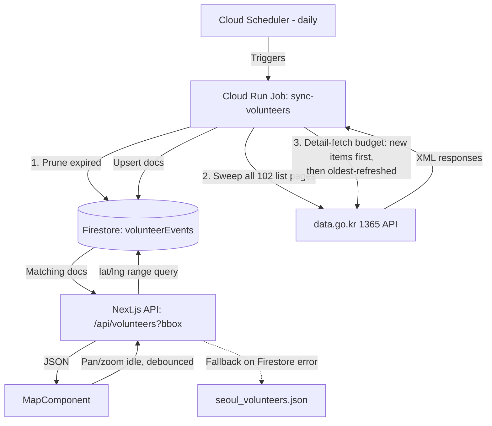

# Design Spec: Firestore-Backed Sync Job + Viewport Queries

**Date:** 2026-07-17
**Status:** Approved by User
**Topic:** Data pipeline architecture (Firestore, Cloud Run Job, Cloud Scheduler)

---

## 1. Overview

Today `/api/volunteers` live-fetches from data.go.kr's 1365 volunteer API on every
request whose in-memory cache is cold, only ever requesting page 1 (100 of the
10,143 total nationwide listings). Because Cloud Run scales instances to zero when
idle, the in-memory cache rarely survives long enough to matter in production —
confirmed via Cloud Run logs on 2026-07-16, where 13 requests to `/api/volunteers`
spanned 3 separate revisions/cold-starts over ~8.5 hours, each likely triggering its
own full live fetch (~100 detail-endpoint calls apiece). This makes quota usage
unpredictable and tied to incidental traffic rather than anything we control, while
also permanently capping visible listings at under 1% of what's available.

This design replaces the live-fetch-on-request model with:
1. A **Cloud Run Job**, triggered daily by **Cloud Scheduler**, that syncs data.go.kr
   listings into **Firestore** under a fixed daily call budget.
2. The web service reading from Firestore via a **viewport (bounding-box) query**
   instead of loading the entire dataset — the map only ever needs pins currently
   visible, and Firestore reads scale with result-set size rather than total
   collection size.

The web service no longer calls data.go.kr at all. Quota consumption becomes solely
the job's responsibility, on a schedule we control.

---

## 2. Architecture & Data Flow

---

## 3. Data Model

Single Firestore collection `volunteerEvents`, **Native mode**, region `asia-northeast3`
(co-located with Cloud Run). Document ID = `progrmRegistNo` (the existing `id` field) —
stable and makes every write an idempotent upsert.

### Fields
| Field | Source | Notes |
|---|---|---|
| `title`, `category`, `startDate`/`endDate`, `recruitStartDate`/`recruitEndDate`, `externalUrl` | list endpoint | unchanged from today |
| `organization` | list endpoint's `nanmmbyNm` | **not** detail endpoint's `nanmmbyNm` — same tag name, different meaning per endpoint (list: host org; detail: overseeing district office). Detail's true host-org field is `mnnstNm`, kept as a fallback only. |
| `lat`, `lng` | detail endpoint's `areaLalo1/2/3` (fallback: Google geocoding of `actPlace`) | **top-level numeric fields**, not nested, so they're indexable |
| `description` | detail endpoint's `progrmCn` | unchanged |
| `spotsNeeded`, `spotsFilled` | detail endpoint's `rcritNmpr`/`appTotal` | unchanged |
| `adultPosblAt`, `yngbgsPosblAt` | list endpoint | free during sweep, no detail call needed |
| `familyPosblAt`, `grpPosblAt`, `pbsvntPosblAt` | detail endpoint | eligibility flags, detail call already happening |
| `actWkdy` | detail endpoint | 7-char Mon-Sun weekday bitmap, decoded client-side for display |
| `email`, `telno` | detail endpoint | shown as `mailto:`/`tel:` links when present |
| `expiresOn` | derived from `endDate` (fallback `startDate`) | drives prune-phase deletion |
| `lastDetailFetchAt` | job bookkeeping | drives steady-state refresh rotation |
| `sourcePage` | job bookkeeping | lets a resumed backfill know where it left off |

**Index:** composite `(lat ASC, lng ASC)` for the bounding-box query.

**Expired listings are deleted outright** (not flagged) during the prune phase — no
feature today uses historical data, so keeping the collection lean and read-cheap
wins over preserving history.

---

## 4. Job Logic (Cloud Run Job `sync-volunteers`, daily via Cloud Scheduler)

Runs three phases in order, under a combined budget of ~950 data.go.kr calls/run
(headroom under the ~1,000/day cap). The job tracks its own call count in-memory and
hard-stops issuing new requests once the budget is hit, regardless of phase.

1. **Prune** — delete Firestore docs where `expiresOn < today`. Pure Firestore
   operation, no external calls.
2. **Sweep** — walk all 102 list pages (~102 calls). For each item: if its ID isn't
   in Firestore, queue it as "new". If it is, patch list-sourced fields directly
   (no detail call needed for fields the list endpoint already provides).
3. **Detail-fetch budget** (~800-850 remaining calls) — spend first on "new" items
   from phase 2 (drives the ~2-week initial backfill of all 10,143 listings). Once
   there's no new-item backlog, spend the remainder refreshing existing docs ordered
   by oldest `lastDetailFetchAt` (steady-state: every listing refreshed roughly every
   5-7 days).

Each phase commits its writes incrementally (not one giant transaction) — a
mid-run crash or timeout leaves partial progress committed, and the next day's run
resumes from the queues rather than restarting.

---

## 5. Web Service Changes

`/api/volunteers` becomes a Firestore reader instead of a data.go.kr proxy:
`GET /api/volunteers?swLat=..&swLng=..&neLat=..&neLng=..` runs a lat/lng range query
against `volunteerEvents` and returns matching docs as JSON (same shape as today plus
the new fields). No more `DATA_GO_KR_API_KEY`/`GOOGLE_MAPS_API_KEY` env vars on the
web service — it only needs Firestore read access (`roles/datastore.viewer`).

If Firestore is unreachable or the query errors, fall back to the existing
`seoul_volunteers.json` mock data (same fallback pattern already in place).

---

## 6. Frontend Changes (`MapComponent.tsx`)

- **Viewport-based fetching:** on map idle (pan/zoom-end, debounced ~300-500ms),
  fetch `/api/volunteers` with the current viewport's bounding box instead of
  fetching once on mount.
- **Zoom cutoff:** below city/metro-level zoom (roughly Kakao level 8-9), skip the
  fetch and show a "Zoom in to see volunteer opportunities" prompt instead of pins —
  a nationwide view isn't useful pin-by-pin anyway.
- **Card additions:**
  - Eligibility badges (family/group/youth/adult) — only rendered for flags that are
    `Y`, to avoid a wall of "no" badges.
  - Weekday schedule decoded from `actWkdy` into a readable form (e.g. "Mon-Fri").
  - Contact row (`mailto:`/`tel:` links) shown only when `email`/`telno` are present.
- Existing client-side "hide filled" filter is unchanged — it still filters
  whatever the current viewport query returns.

---

## 7. Infrastructure (Terraform)

New resources in `terraform/`:
- `google_firestore_database` (Native mode, `asia-northeast3`) — not yet provisioned
  in this project.
- Firestore composite index for `(lat, lng)`.
- `google_cloud_run_v2_job` for `sync-volunteers`, its own service account with
  `roles/datastore.user` plus the `DATA_GO_KR_API_KEY` env var.
- `google_cloud_scheduler_job` invoking the Cloud Run Job daily, with an invoker
  service account scoped to `roles/run.invoker` on just that job.
- Existing web service: drop `DATA_GO_KR_API_KEY`/`GOOGLE_MAPS_API_KEY` env vars,
  add `roles/datastore.viewer` for its service account.

---

## 8. Error Handling & Testing

- **Job resilience:** incremental commits per phase; a crash mid-run loses no
  already-written progress.
- **Quota safety:** hard in-memory call-count stop at ~950/run.
- **Web fallback:** mock data on any Firestore error, matching today's behavior.
- **Unit tests:** field-merge precedence (especially the `nanmmbyNm` list-vs-detail
  mismatch) and the `actWkdy` bitmap decoder, against fixed XML fixtures — no live
  API calls in tests.
- **Frontend (Playwright):** pan/zoom triggers a refetch with updated bounds;
  zoom-out below the cutoff shows the prompt and renders no pins.

---

## 9. Spec Self-Review

- **Placeholders:** None.
- **Internal consistency:** The `organization` field's source (list endpoint's
  `nanmmbyNm`) is called out explicitly to prevent the sync job's field-merge logic
  from overwriting it with the detail endpoint's differently-scoped same-named tag.
- **Scope:** Focused to the DB/pipeline migration plus the viewport-query and
  extra-field additions the user asked to fold in during this same design; no
  unrelated refactoring included.
- **Resilience:** Preserves the existing mock-data fallback pattern on the read
  path; the job's incremental-commit design avoids partial/corrupt state on
  mid-run failures.
